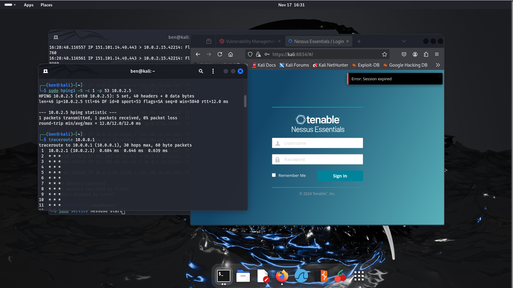
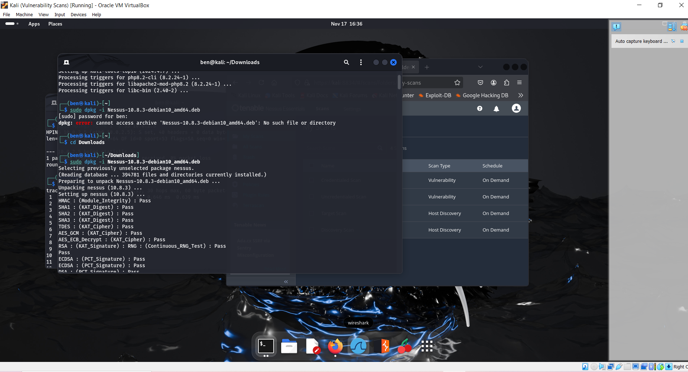
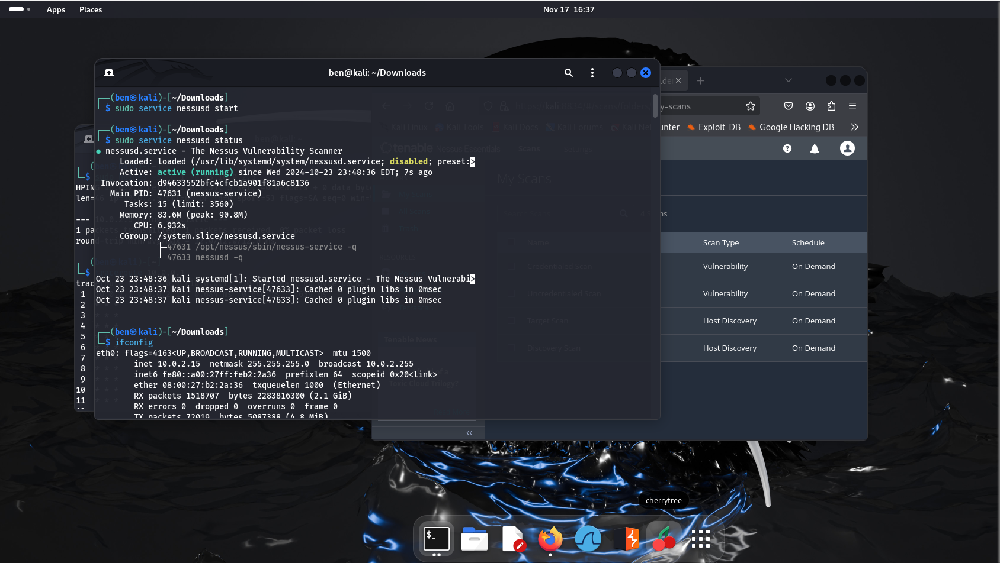
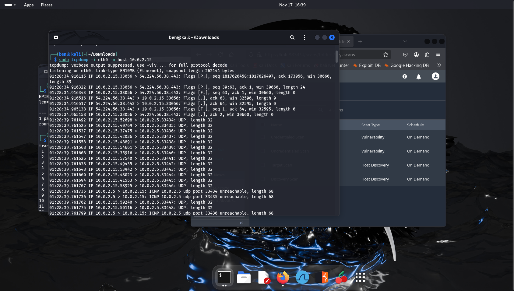

Text can be **bold**, _italic_, ~~strikethrough~~ or `keyword`.

[Link to another page](./another-page.html).

There should be whitespace between paragraphs.

There should be whitespace between paragraphs. We recommend including a README, or a file with information about your project.

# Introduction 

Hello, I am Ben and I am aspiring IT/Cyber Security professional. This my Github portfolio where I show and explain some projects that I am working on.
These projects are all ran in my home lab which is basically a bunch of virtual machines I put together either to practice tools/skills I want to obtain
for my career.

# Project 1
## Vulnerability Management
> In this project I set up a practiced host scannning, vulnerability scan, view found vulenerabilities, and generating a report with Tenable Nessus
> 

#### Software/Tools used in lab

*   Kali Linux
*   Metasploitable 2
*   Tenable Nessus


For this project I wanted to mess around and learn about some Vulnerability Management tools. Tenable Nessus was always a tool that I've seen people bring up
when talking about Vulnerability Management so I decided to give it a try. I already have had a Kali VM created but in order to actually test Nessus I needed an attack Machine and that's why I had created a Metaspoitable 2 VM. Creating a VM is kind of striaght forward, especially for what I need, so I won't go through all of those steps. But, I will walk you through setting up Tenable Nessus and practicing what I can do with it.


The first thing I have done once setting up both VMs is play around with the connectivity of the devices. 







The next little test I run is a tcp dump command, which looks like this:
```sudo tcpdump -i eth0 -n host METASPLOITABLE_IP```



[Project 1](https://github.com/ForeverBenIncognito/Incognito.github.io/blob/630d996342a2f1c703b7188c9a677f3e5b3cbccb/Project%201.md).


# Project 2
## Azure SIEM and Honeypot
> In this project I set up a honey pot in Azure and used Microsoft Sentinel as a SIEM to monitor network traffic
> 

#### Software/Tools used in lab

*   Azure Sentinel
*   Forwarder
*   RDP

``` KQL
SecurityEvent 
| where Activity contains "success" and Account !contains "system"
```

# Project 3
## Active Directory 
> Window Server
> 
> Windows 10.
> Splunk Docker
> Sysmon

## Header 2

> This is a blockquote following a header.
>
> When something is important enough, you do it even if the odds are not in your favor.

### Header 3

```js
// Javascript code with syntax highlighting.
var fun = function lang(l) {
  dateformat.i18n = require('./lang/' + l)
  return true;
}
```

```ruby
# Ruby code with syntax highlighting
GitHubPages::Dependencies.gems.each do |gem, version|
  s.add_dependency(gem, "= #{version}")
end
```

#### Header 4

*   This is an unordered list following a header.
*   This is an unordered list following a header.
*   This is an unordered list following a header.

##### Header 5

1.  This is an ordered list following a header.
2.  This is an ordered list following a header.
3.  This is an ordered list following a header.

###### Header 6

| head1        | head two          | three |
|:-------------|:------------------|:------|
| ok           | good swedish fish | nice  |
| out of stock | good and plenty   | nice  |
| ok           | good `oreos`      | hmm   |
| ok           | good `zoute` drop | yumm  |

### There's a horizontal rule below this.

* * *

### Here is an unordered list:

*   Item foo
*   Item bar
*   Item baz
*   Item zip

### And an ordered list:

1.  Item one
1.  Item two
1.  Item three
1.  Item four

### And a nested list:

- level 1 item
  - level 2 item
  - level 2 item
    - level 3 item
    - level 3 item
- level 1 item
  - level 2 item
  - level 2 item
  - level 2 item
- level 1 item
  - level 2 item
  - level 2 item
- level 1 item

### Small image


### Large image


### Definition lists can be used with HTML syntax.

<dl>
<dt>Name</dt>
<dd>Godzilla</dd>
<dt>Born</dt>
<dd>1952</dd>
<dt>Birthplace</dt>
<dd>Japan</dd>
<dt>Color</dt>
<dd>Green</dd>
</dl>

```
Long, single-line code blocks should not wrap. They should horizontally scroll if they are too long. This line should be long enough to demonstrate this.
```

```
The final element.
```
