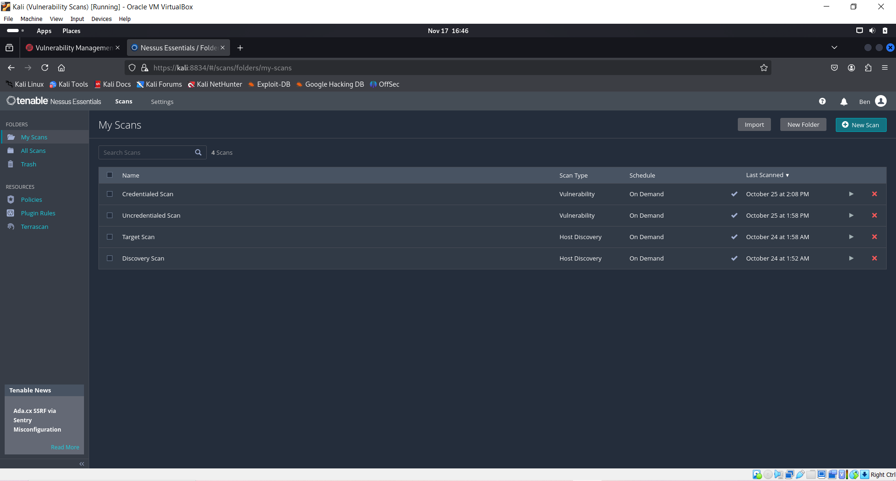
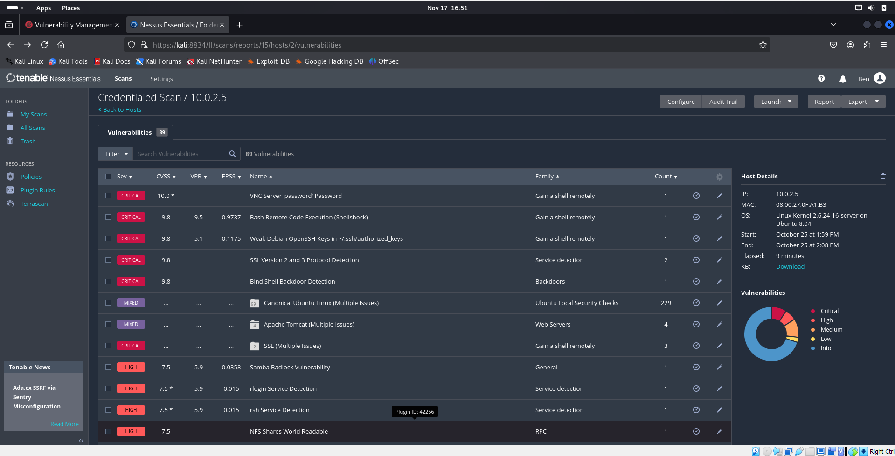

# Introduction 

Hello, I am Ben and I am aspiring IT/Cyber Security professional. This my Github portfolio where I show and explain some projects that I am working on.
These projects are all ran in my home lab which is basically a bunch of virtual machines I put together either to practice tools/skills I want to obtain
for my career.

# Project 1
## Vulnerability Management
> In this project I set up a practiced host scannning, vulnerability scan, view found vulenerabilities, and generating a report with Tenable Nessus
> 

#### Software/Tools used in lab

*   Kali Linux
*   Metasploitable 2
*   Tenable Nessus


For this project I wanted to mess around and learn about some Vulnerability Management tools. Tenable Nessus was always a tool that I've seen people bring up
when talking about Vulnerability Management so I decided to give it a try. I already have had a Kali VM created but in order to actually test Nessus I needed an attack Machine and that's why I had created a Metaspoitable 2 VM. Creating a VM is kind of striaght forward, especially for what I need, so I won't go through all of those steps. But, I will walk you through setting up Tenable Nessus and practicing what I can do with it.


The first thing I have done once setting up both VMs is play around with the connectivity of the devices. 


The next little test I run is a tcp dump command, which looks like this:
```sudo tcpdump -i eth0 -n host METASPLOITABLE_IP```


When you let it run you can see all type of things going on under the hood. ARP requests, 3 way handshake, etc. Looking at this is a good way to understand how computers communicate and the processes it can go through. Nothing specific I am looking for here though, so let's move on to actually setting Nessus up.
I am using Nessus Essentials which is the free version and to get this you have to go to their webpage, sign up, get an activation code, and then download Tenable Nessus. Once all of that is done I moved to actually getting this thing to deploy and work. 

Here are the commands I used to get the service started and make sure it's running. 
```
sudo service nessusd start
sudo service nessusd status
```


Once I got it up and running I ran 2 host discoveries scans and 2 vulnerability scans and you can see it in the home, my scans section.



Host discovery scans are kind of like nmap the way I see it. Pretty much scans a network, specific ip range, or a single IP and see the details about the 
devices found, as well as any other devices that found that you didn't know about. Now a vulnerability scan is different and it is pretty self explanitory,
it scans for vulnerabilities on a system. There are 2 types of vulnerability scans I tried out. Credentialed vs. Uncredentialed.


## Uncredential Scan


## Credential Scan


As you can see they differ in what they find and this is because credentialed scans are more thorough because they can access more due to having the credentials
of the device. Now taking a closer look at some of the vulnerabilities found.


## Credential Scan


There can be a lot of vulnerabilities to search through and doing so by scrolling can take a lot of time and you may need to search for a specific vulnerability.
To help with that there is a filter button that we can use to help. Here is an example of what I would put in order to find an critical remote access exploitation:


And here are the results of that search


Now that I have went through the basis of Nessus and how to run and review scans, I need to now learn how to report this. And luckly Nessus makes it easy, all you have to do really is click the report button at the top right of the page and it bring up this:


There are plenty of options and filters for the report you can mess around with but this is pretty much the last thing I have done with this project.
It was actually pretty straight forward but I like Vulnerability Management a lot and it is really important in a business setting. A way I can take this to the 
next level is by creating scripts and learning how to automate some of these things.

[Project 1](https://github.com/ForeverBenIncognito/Incognito.github.io/blob/630d996342a2f1c703b7188c9a677f3e5b3cbccb/Project%201.md).


# Project 2
## Azure SIEM and Honeypot
> In this project I set up a honey pot in Azure and used Microsoft Sentinel as a SIEM to monitor network traffic
> 

#### Software/Tools used in lab

*   Azure 
*   Micrsoft Sentinel
*   RDP

Cloud Computing is one of the hottest topics in the IT/Cyber world right now and I am a big fan and user of Microsoft products (Xbox lol), so it is only right that I mess with and learn a little about Azure. While looking into Azure a little I found out that the have their own SIEM, in the cloud, and it is fairly simple to get started with. So this project really seemed cool to me and everything was pointing at it. 

  I was using the free trial subscription at first which gives you $200 free credit for a month. I did the project like a month ago so I can't exactly replicate all the steps I took but I do have enough screenshots to walk you through what I have done so far. These are all the resources that were created and used for this project, under a resource group I named SIEM.


The first thing that I did though was create a virtual machine. Once created I made sure port 3389 was open so that I can RDP into this Virtual Machine. Leaving that port open can something that is view as dangerous because people can try to get remote access to your machine. But we won't leave it open for too long and it is neccessary to create some alerts that I will explore later. When connecting to the VM it looked like this:


``` KQL
SecurityEvent 
| where Activity contains "success" and Account !contains "system"
```

# Project 3
## Active Directory 
> Window Server
> 
> Windows 10.
> Splunk Docker
> Sysmon

## Header 2

> This is a blockquote following a header.
>
> When something is important enough, you do it even if the odds are not in your favor.

### Header 3

```js
// Javascript code with syntax highlighting.
var fun = function lang(l) {
  dateformat.i18n = require('./lang/' + l)
  return true;
}
```

```ruby
# Ruby code with syntax highlighting
GitHubPages::Dependencies.gems.each do |gem, version|
  s.add_dependency(gem, "= #{version}")
end
```

#### Header 4

*   This is an unordered list following a header.
*   This is an unordered list following a header.
*   This is an unordered list following a header.

##### Header 5

1.  This is an ordered list following a header.
2.  This is an ordered list following a header.
3.  This is an ordered list following a header.

###### Header 6

| head1        | head two          | three |
|:-------------|:------------------|:------|
| ok           | good swedish fish | nice  |
| out of stock | good and plenty   | nice  |
| ok           | good `oreos`      | hmm   |
| ok           | good `zoute` drop | yumm  |

### There's a horizontal rule below this.

* * *

### Here is an unordered list:

*   Item foo
*   Item bar
*   Item baz
*   Item zip

### And an ordered list:

1.  Item one
1.  Item two
1.  Item three
1.  Item four

### And a nested list:

- level 1 item
  - level 2 item
  - level 2 item
    - level 3 item
    - level 3 item
- level 1 item
  - level 2 item
  - level 2 item
  - level 2 item
- level 1 item
  - level 2 item
  - level 2 item
- level 1 item

### Small image


### Large image


### Definition lists can be used with HTML syntax.

<dl>
<dt>Name</dt>
<dd>Godzilla</dd>
<dt>Born</dt>
<dd>1952</dd>
<dt>Birthplace</dt>
<dd>Japan</dd>
<dt>Color</dt>
<dd>Green</dd>
</dl>

```
Long, single-line code blocks should not wrap. They should horizontally scroll if they are too long. This line should be long enough to demonstrate this.
```

```
The final element.
```
